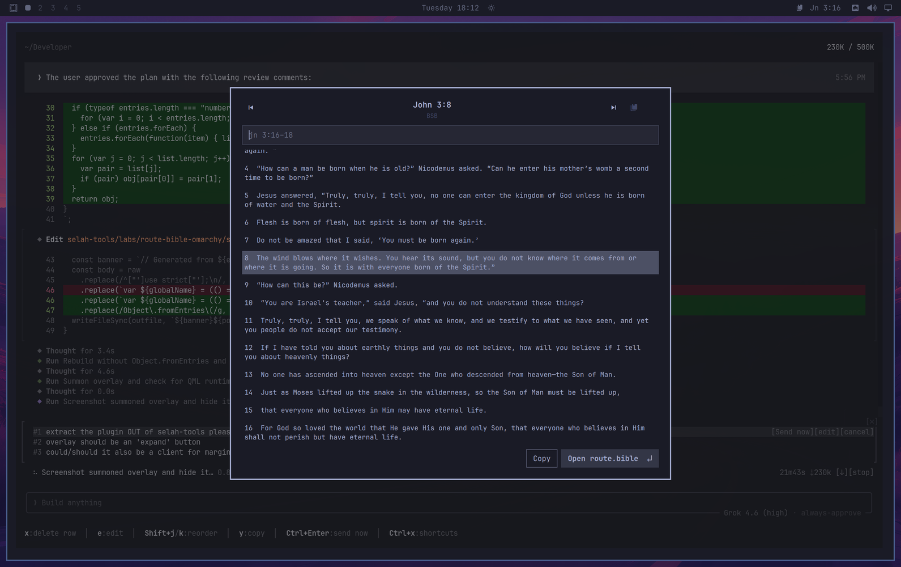
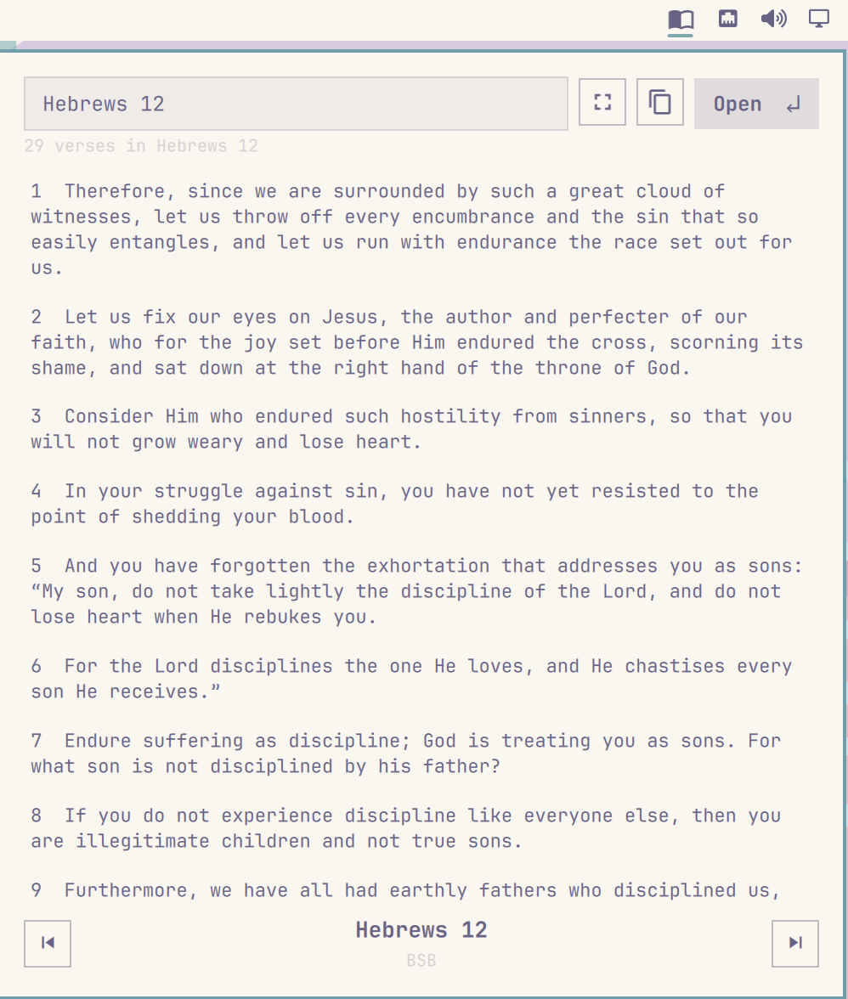

# The Bible

Read the Berean Standard Bible from the Omarchy bar, select verses, and open them on [route.bible](https://route.bible).

Plugin id: `io.github.dpshde.the-bible`.

The default surface is a **right-side popup** from the bar chip. Use the **expand** button (or `f`) to open the fullscreen overlay.

This plugin runs inside the existing Omarchy shell process. It does not start a second Quickshell instance, does not install packages, and does not edit your Hyprland bindings or other user config.

## Screenshots





## Install

```sh
omarchy plugin add https://github.com/dpshde/omarchy-the-bible.git --enable
omarchy bar move io.github.dpshde.the-bible --section right
```

Or from a local checkout:

```sh
pnpm install
pnpm fetch-bsb
pnpm build
pnpm install:local
omarchy plugin validate ~/.config/omarchy/plugins/io.github.dpshde.the-bible
omarchy plugin enable io.github.dpshde.the-bible --section right
```

`install:local` copies files (no symlinks — Omarchy forbids them in plugin folders).

## Usage

- **Left-click** the bar chip to open or close the popup.
- **Scroll** the chip to move to the previous or next chapter.
- **Middle-click** the chip to open the current selection on route.bible immediately.
- Type a reference (`jn 3:16-18`, `Psalm 23`, a bible.com link). Tab or Enter accepts the top suggestion and adds a space; chapter/verse counts show as you type. Down from the input hovers verse 1; Up/Down then move the hover. Up from verse 1 returns to the input. Left/Right change chapter; Ctrl+Left/Right change book.
- **Ctrl+Enter** in the search field opens that passage on route.bible immediately.
- Click-drag verses, or hold Space and use the arrow keys, to select a range. Tap Space to drop the current range and select only the hovered verse.
- **Enter** (with the reader focused) opens route.bible for the selection.
- **Outline** (or `m`, Shift+Enter) opens the same passage on [margin.bible](https://margin.bible) so you can outline it.
- **B** opens the book picker, **C** the chapter grid, **/** focuses search, **Y** copies the URL, **Ctrl+C** copies the selected text.
- **Expand** (or `f`) opens the overlay. The window icon pops the overlay into its own window (click again to dock). Esc steps back to the popup. `F11` toggles fullscreen.
- Escape clears search, steps back through pickers, then closes.

Optional Hyprland bind (add this yourself; the plugin does not edit your bindings):

```lua
o.bind("SUPER + SHIFT + B", "The Bible", "omarchy-shell shell summon io.github.dpshde.the-bible '{}'")
```

## Configure

```sh
omarchy bar move io.github.dpshde.the-bible --section right
```

Reading position is stored at `~/.local/state/omarchy/settings/route-bible.json`. The plugin creates that file if needed and does not touch other settings.

## Remove

```sh
omarchy plugin remove io.github.dpshde.the-bible
```

Reading position in `~/.local/state/omarchy/settings/route-bible.json` is left in place.

## License and dependencies

The plugin is MIT-licensed. See `LICENSE` and `NOTICE.md`.

Runtime:

- Bundled [Berean Standard Bible](https://berean.bible/) text and section headers (public domain), fetched at build time from the official [USJ pack](https://bereanbible.com/bsb_usj.zip). Verse lookup does not call the network.
- Bundled [grab-bcv](https://www.npmjs.com/package/grab-bcv) parser (`js/GrabBcv.js`).
- Opens [route.bible](https://route.bible) and [margin.bible](https://margin.bible) with `omarchy launch browser` when you ask it to.
- Copies text and URLs with `wl-copy`.

Build-time only (`pnpm` / Node): `grab-bcv`, `esbuild`, TypeScript, Vitest, oxlint. Marketplace install uses the committed `js/` and `data/` files and does not need Node.
